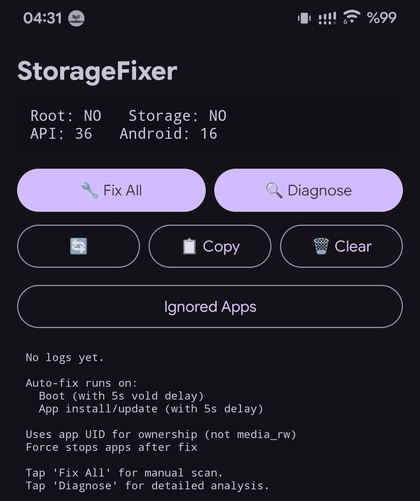
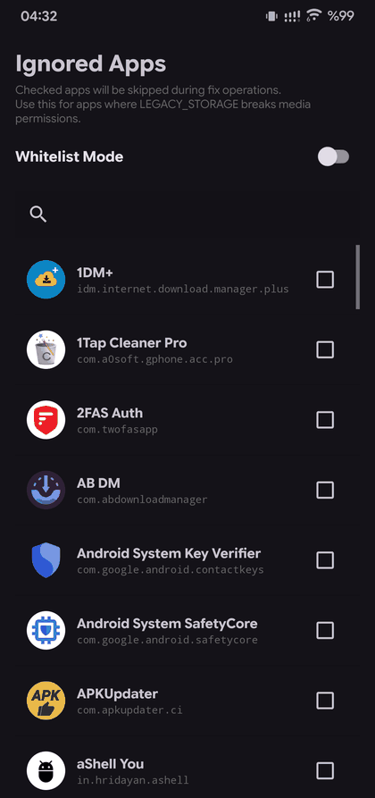
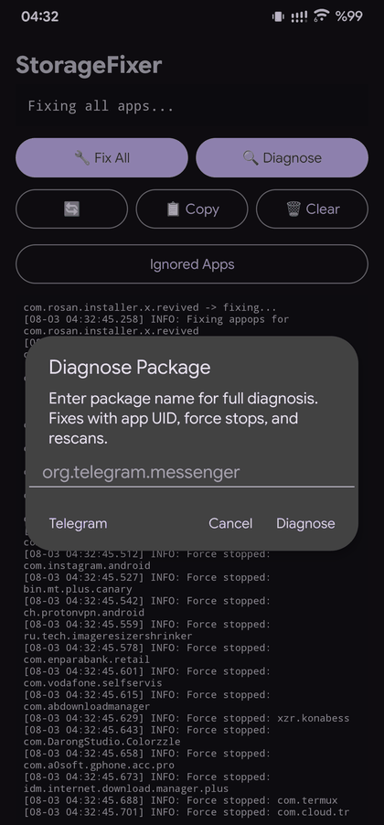
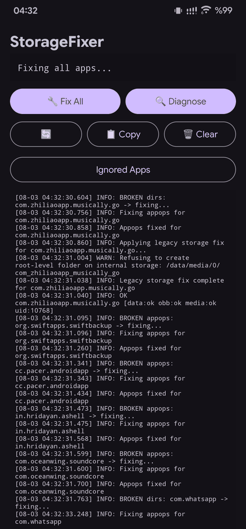
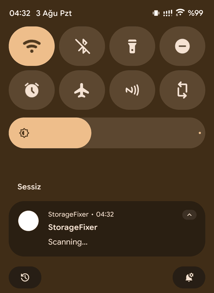
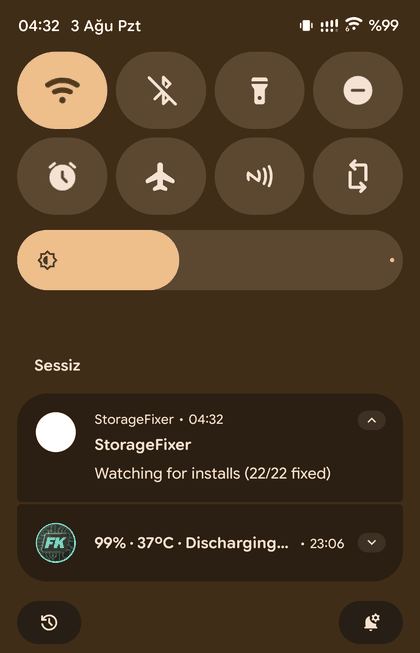

# StorageFixer

**Fixes Android 16 QPR1+ storage permission bugs on AOSP-based ROMs.*

[](https://github.com/omersusin/StorageFixer/releases/latest)


A root Android app (plus an optional Xposed module) that repairs the broken `Android/data` / `Android/obb` / `Android/media` directories and appops that Android 16 QPR1+ leaves behind on AOSP-based ROMs — automatically, on boot and on every new install.

### Contents

- [The Problem](#the-problem)
- [Screenshots](#screenshots)
- [How It Works](#how-it-works)
- [Installation](#installation)
- [Supported Apps](#supported-apps)
- [App Features](#app-features)
- [Technical Details](#technical-details)
- [Building](#building)
- [FAQ](#faq)
- [Credits](#credits)
- [License](#license)

---

## The Problem

On AOSP-based ROMs built on **Android 16 QPR1+**, the system fails to properly create or set permissions on scoped storage directories during app installation:

- `/storage/emulated/0/Android/data/<package>/`
- `/storage/emulated/0/Android/obb/<package>/`
- `/storage/emulated/0/Android/media/<package>/`

This causes apps like **PUBG**, **Telegram**, **WhatsApp**, and many others to fail with storage access errors such as:

- "read/write permission error"
- "Unable to create directory"
- "You don't have applications that can handle the file type"

### Root Cause

Android 16 QPR1+ uses **f2fs bind-mounts** for `Android/data` and `Android/obb` directories instead of routing them through FUSE.

This causes two issues:

**1. Storage Directory Bug**

`vold` (Volume Daemon) fails to create app directories with correct permissions due to missing SELinux policies or broken FUSE passthrough patches.

**2. FileProvider Bug**

`FileProvider.getUriForFile()` internally calls `File.getCanonicalPath()`, which resolves the f2fs bind-mount to the lower filesystem path (`/data/media/0/...`) instead of the expected FUSE path (`/storage/emulated/0/...`). This causes a silent `IllegalArgumentException`, preventing apps from sharing files via `content://` URIs.

---

## Screenshots

<table>
<tr>
<td align="center" width="50%">

<br/><sub><b>Home</b> — root/storage status, Fix All &amp; Diagnose</sub>
</td>
<td align="center" width="50%">

<br/><sub><b>Ignored Apps</b> — same list doubles as a blacklist or a whitelist</sub>
</td>
</tr>
<tr>
<td align="center" width="50%">

<br/><sub><b>Fix All</b> in progress, with the per-package <b>Diagnose</b> dialog</sub>
</td>
<td align="center" width="50%">

<br/><sub>Live log — directory fix, appops fix, and a guarded root-folder refusal</sub>
</td>
</tr>
</table>

<table>
<tr>
<td align="center" width="33%">

<br/><sub><code>Waiting for storage…</code></sub>
</td>
<td align="center" width="33%">

<br/><sub><code>Scanning…</code></sub>
</td>
<td align="center" width="33%">

<br/><sub><code>Watching for installs (22/22 fixed)</code></sub>
</td>
</tr>
</table>

The persistent notification steps through these states — `Waiting for storage…` → `Scanning…` → `Fixing all apps…` → `Watching for installs (X/Y fixed)` — then stays alive so `FixerService` can catch new installs immediately.

---

## How It Works

StorageFixer is a **hybrid solution** — a root Android app combined with an optional LSPosed/Xposed module.

### Root Service (Storage + Appops Fix)

| Feature | Description |
|--------|-------------|
| Boot-time scan | Scans all 3rd-party apps on boot, after a 5s `vold` delay, and fixes missing directories |
| Persistent install watcher | `FixerService` stays running in the foreground after the boot scan and dynamically registers a receiver for `PACKAGE_ADDED`, `PACKAGE_REPLACED`, and `DOWNLOAD_COMPLETE` (5s delay before fixing) — more reliable than a static manifest receiver, which the system could kill before it ever fired |
| Directory fix | Restores `Android/data`, `Android/obb`, and `Android/media` for a package and sets ownership to the app's real UID (not `media_rw`) |
| Appops fix | Separately detects and repairs broken per-app appops (e.g. `LEGACY_STORAGE`), tracked and logged apart from the directory fix |
| Guarded root creation | Refuses to create new top-level folders directly under a storage root (e.g. the sdcard root) unless they already exist — logged as `WARN: Refusing to create root-level folder on internal storage: ...` |
| Ignored Apps / Whitelist mode | One checklist, two behaviors: by default checked apps are **skipped**; flip **Whitelist Mode** and the same list becomes the **only** apps fixed |
| Force stop | Force stops fixed apps so they pick up new permissions |
| Diagnose | Full diagnosis + fix for one package by name — fixes storage & appops, force-stops, and rescans |
| MediaProvider rescan | Triggers a volume rescan after fixes |

### Xposed Module (FileProvider Fix)

| Feature | Description |
|--------|-------------|
| FileProvider hook | Intercepts `FileProvider.getUriForFile()` |
| Path rewriting | Rewrites bind-mount paths back to FUSE paths |
| Zero permission changes | Does not touch runtime permissions or `appops` |
| Scoped | Only hooks apps you select in LSPosed |

### Fix Flow

Device boots → `FixerService` starts (notification: `Waiting for storage…`) → Waits for FUSE + 5s `vold` delay → Scans all apps (`Scanning…` / `Fixing all apps…`) → Fixes broken directories and appops, skipping/limiting to apps per the Ignored Apps list → Force stops fixed apps → Registers a package receiver and keeps running in the foreground (`Watching for installs (X/Y fixed)`)

New app installed or updated → Package receiver (running inside `FixerService`) fires after a 5s delay → Fixes directories and appops if broken, respecting Ignored Apps / Whitelist mode → Force stops the app

App shares a file → Xposed hook intercepts FileProvider → Rewrites path → Valid `content://` URI generated → File opens normally

---

## Installation

### Requirements

- Android 14–16 (API 34–36)
- Root access (Magisk or KernelSU)
- LSPosed (optional)

### Steps

1. Download the latest APK from **Releases**
2. Install the APK
3. Open StorageFixer and grant **root access**
4. Disable **battery optimization**
5. Grant **notification permission** — the persistent foreground notification is what lets `FixerService` catch new installs instantly
6. (Optional) Open **Ignored Apps** to skip specific apps, or flip **Whitelist Mode** to fix only a chosen few
7. (Optional) Enable the **Xposed module in LSPosed**

---

## Supported Apps

| App | Storage Fix | FileProvider Fix |
|-----|-------------|------------------|
| PUBG Mobile | ✅ | — |
| Telegram | ✅ | ✅ |
| WhatsApp | ✅ | ✅ |
| Instagram | ✅ | — |
| MT Manager | ✅ | — |
| YouTube | ✅ | — |
| Reddit | ✅ | — |
| Chrome | ✅ | — |
| 95+ other apps | ✅ | — |

Fixing *every* app isn't always desirable — for a handful of apps (Google Photos backups being the most reported case), across-the-board fixes have caused side effects. Add those apps under **Ignored Apps** to skip them, or use **Whitelist Mode** to only fix the apps you actually need.

---

## App Features

| Feature | Description |
|--------|-------------|
| Fix All | Scan every installed app and fix broken directories + appops |
| Diagnose | Enter a package name for a full targeted fix: storage, appops, force-stop, rescan |
| Ignored Apps / Whitelist Mode | Choose which apps are skipped (default), or — with Whitelist Mode on — the *only* apps fixed |
| Copy Logs | Copy the session log to clipboard |
| Clear Logs | Clear log history |
| Auto-fix | Runs on boot (5s `vold` delay) and continuously in the background for new installs/updates (5s delay) |
| Status header | Shows root access, storage-permission state, and detected API level / Android version at a glance |

---

## Technical Details

### Why Other Solutions Fail

| Solution | Problem |
|---------|--------|
| Magisk shell modules | `inotifyd` unreliable |
| Boot scripts | Race condition with `vold` |
| `appops` hacks | Breaks Android 14+ Photo Picker |
| Manual fixes | Not automated |

### Why StorageFixer Works

1. Correct timing — waits for `vold` failure
2. Lower filesystem — operates on `/data/media/0`
3. Correct ownership — sets app UID
4. Persistent, broadcast-based detection — `FixerService` keeps a dynamically registered receiver alive instead of relying on a manifest receiver that the system can kill before `PACKAGE_ADDED` fires
5. Guarded directory creation — won't create new folders at the root of a storage volume, only within apps' own directories or paths that already exist:
   ```
   WARN: Refusing to create root-level folder on internal storage: /data/media/0/<package>
   ```
6. Separate appops repair — broken appops (e.g. `LEGACY_STORAGE`) are diagnosed and fixed independently of the directory fix, with their own `BROKEN appops → Fixing → Fixed` log trail
7. Xposed hook — fixes FileProvider without permission hacks
8. Ignored Apps / Whitelist mode — scope fixes down to a handful of apps instead of applying them device-wide

A typical per-package log trail looks like:

```
[08-03 04:32:30.604] INFO: BROKEN dirs: com.example.app -> fixing...
[08-03 04:32:30.756] INFO: Fixing appops for com.example.app
[08-03 04:32:30.858] INFO: Appops fixed for com.example.app
[08-03 04:32:30.860] INFO: Applying legacy storage fix for com.example.app...
[08-03 04:32:31.004] WARN: Refusing to create root-level folder on internal storage: /data/media/0/com_example_app
[08-03 04:32:31.038] INFO: Legacy storage fix complete for com.example.app
[08-03 04:32:31.040] INFO: OK com.example.app [data:ok obb:ok media:ok uid:10768]
```

### Mount Configuration (Android 16 QPR1+)

```
/dev/fuse on /mnt/installer/0/emulated type fuse
/dev/block/dm-XX on .../Android/data type f2fs (bind-mount)
/dev/block/dm-XX on .../Android/obb type f2fs (bind-mount)
```

---

## Building

### Prerequisites

- GitHub account
- GitHub Actions enabled

### Steps

1. Fork the repository
2. Push a commit
3. Go to **Actions**
4. Download the built APK artifact

Release builds are signed in CI with a dedicated release keystore (credentials pulled from environment variables/secrets), so APKs published under **Releases** aren't debug-signed.

---

## FAQ

**Do I need LSPosed?**
Only if you experience the FileProvider bug.

**Will this break apps?**
Fixing a specific app's directories and appops shouldn't break it. Fixing *every* app has, in some cases, interfered with apps like Google Photos backups — add those to **Ignored Apps**, or turn on **Whitelist Mode** and only fix what you need.

**What's the difference between Ignored Apps and Whitelist Mode?**
They're the same checklist. With Whitelist Mode **off** (default), checked apps are excluded from fixes. Turn Whitelist Mode **on** and the checked apps become the *only* ones StorageFixer will fix.

**Why does it fix "appops" as well as directories?**
Some apps break not because of missing directories but because of a broken per-app appop — most commonly `LEGACY_STORAGE`. StorageFixer diagnoses and repairs that separately, which is why the log shows distinct `BROKEN dirs` and `BROKEN appops` entries for the same package.

**Why does StorageFixer show a persistent notification?**
`FixerService` stays running in the foreground so it can reliably catch new installs and updates the moment they happen. An earlier approach relied on a manifest-registered receiver that Android could kill before it ever fired, meaning the fix only applied after a reboot.

**Does it survive reboot?**
Yes. It runs again on boot.

**Which ROMs are affected?**
AOSP-based ROMs built on Android 16 QPR1 or newer.

---

## Credits

- libsu — topjohnwu
- XposedBridge — rovo89

### Contributors

- Whitelist mode & status bar padding fix — [@Kamjue](https://github.com/Kamjue)
- Persistent install watcher & guarded storage-root creation — [@Gronkdalonka](https://github.com/Gronkdalonka)

---

## License

MIT License
